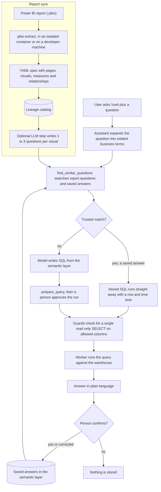

# PowerAI

PowerAI is my extension of SQLFlow, built in this fork. It lets a person ask a business question in plain
language and get an answer from the data warehouse. This README covers my part of the repository. The
original SQLFlow README is in [SQLFLOW.md](SQLFLOW.md).

## The idea

A language model that only sees the warehouse schema has to guess what the business means by "revenue" or
"sales by region". A Power BI report already answers that. Each visual on a report is a question that someone
defined, built and checked against the data. The report file also holds the measures with their DAX, the
relationships between tables, and which field a chart is split by and which one it plots.

PowerAI reads that metadata out of `.pbix` files and uses it as context. Every visual becomes a stored question
with the SQL behind it. A new question is matched against those stored questions, and against answers people
have already confirmed, before the model tries to write a query of its own.

## From question to answer

The top box is what happens when a report is synced. The rest is what happens when someone asks a question.



## Design decisions

**Power BI reports as the source of context.** I started from reports because they record questions the
business already cared about, together with the vocabulary people use for them. The schema alone does not say
that a measure called "Sales Amount by Due Date" uses an inactive relationship, but the report does.

**Extraction never runs inside the control plane.** A `.pbix` is a compressed binary format, so reading one means
running a decompressor over a file someone else made. I wrote the reader as a small C tool (`tools/pbix-extract`)
and kept it away from the control plane, which holds the catalog and warehouse credentials. Reports uploaded in
the GUI are forwarded to a separate `pbix-extractor` container. That container has no credentials, shares an
internal network with the control plane only, and runs with a read only filesystem and every capability dropped.
The control plane checks the YAML it gets back before storing it. The C tool also runs its tests under
AddressSanitizer and UndefinedBehaviorSanitizer, which found an overlapping `memcpy` in the vendored decoder.

**Reports are stored as YAML specs.** The extractor writes a report as a graph of nodes and edges (tables,
columns, measures, relationships, pages, visuals). That spec is what gets committed, uploaded and kept in the
catalog. A sync on a machine without the tool reads the spec instead, so it no longer wipes a report that an
earlier sync extracted.

**The semantic layer is the only schema the model sees.** Columns are denied by default, and an admin allows
them per table on the Semantic layer page. The MCP tools the assistant gets (`get_semantic_layer`,
`search_semantic_layer`, `describe_semantic_table`) only return allowed tables and columns, and an object's
script is held back if any of its columns is not allowed. The model could still guess a column name, so every
query is parsed and checked against the allow list again before it is prepared, saved or run. I added the
PowerAI tools to the MCP server SQLFlow already had, and the assistant reads report models and lineage from the
catalog through them.

**Retrieval moved from embeddings to full text search.** My first version embedded every stored question and
ranked matches by vector similarity. I replaced it because it needed another paid vendor next to the model
provider. Now the model expands the question into related business words, and SQL Server's full text index finds
stored questions that contain them, including other grammatical forms. The score is the number of distinct word
stems that matched. On a SQL Server without full text search the same code falls back to a `LIKE` scan, which
handles word forms less well.

**Confidence comes from the match, not from the model.** A wrong query can sound just as sure as a right one, so
the model is never asked to rate itself. A match counts as trusted when at least two distinct terms match (the
default `RankThreshold`) or when it has the same meaningful words as the typed question. Only a trusted match
from the saved answers runs straight away, and it runs with a row limit and a timeout. Everything else goes
through the normal step where a person approves the query first.

**Only confirmed answers are saved.** Under every answer that contains SQL, the GUI shows Yes, Not quite and No.
Yes saves the question and its SQL. Not quite opens the SQL in an editor and saves the corrected version. No
saves nothing. I first stored rejected answers too, but took that out, because a known bad query in the store
could later come back looking like something that had been checked. The datasource for a saved answer is worked
out from the tables it reads, so nobody has to pick one.

**Business questions start with `!cwd`.** The assistant also answers questions about pipelines, runs and
lineage. A business question has to start with `!cwd` so that the model does not have to guess which kind of
question it got.

**Visual queries are translated to source tables or kept as hints.** A visual's own query is written against
the Power BI model, not the database. During a sync each visual's query is translated into T-SQL over the
source tables, following the Power Query source and the model's active relationships. This covers a limited
subset of DAX. A visual outside that subset keeps the reason and only serves as a hint for the model. The
extractor drops a visual whose filters it cannot represent and names it in a warning, since a query without its
filter would answer a broader question than the one on the page.

**Each assistant run gets its own short lived token.** The model runs at an outside provider, so it never gets
the user's session. Each run gets a delegated token that expires with the run, cannot be renewed, and is refused
by every endpoint not marked as open to the assistant.

**Tests check the numbers as well as the shape.** `tools/powerai-proof` holds 300 questions, each with its SQL
and the result it produced on the AdventureWorksDW sample. `PowerAiProofValueTests` runs them and compares every
cell, so a change that returns a wrong number fails the suite. Other tests cover the guards, retrieval scoring,
the delegated token, the extractor service and the C tool.

## Where the code lives

| Path | What it does |
| --- | --- |
| `tools/pbix-extract` | C tool that reads a `.pbix` and writes the YAML spec |
| `src/SqlFlow.PbixExtractor`, `Dockerfile.pbix-extractor` | The isolated HTTP service that wraps the tool |
| `src/SqlFlow.Lineage/Collection/PbixExtractTool.cs`, `ReportSpecs.cs` | Runs the tool during a sync and validates specs |
| `src/SqlFlow.Lineage/PowerBi` | Translates visual queries and a subset of DAX into T-SQL |
| `src/SqlFlow.ControlPlane/Background/QuestionSearch.cs` | Retrieval and scoring |
| `src/SqlFlow.ControlPlane/Background/SubscriberQuestionEnrichment.cs` | Writes questions for each visual after a sync |
| `src/SqlFlow.ControlPlane/Api/SemanticLayer*.cs`, `ColumnPolicyGuard.cs` | Semantic layer and the allow list check |
| `src/SqlFlow.ControlPlane/Api/QuestionExampleEndpoints.cs`, `DatasourceInference.cs` | Confirming, auto run and datasource inference |
| `src/SqlFlow.ControlPlane/Security/AssistantDelegation.cs` | Delegated token for assistant runs |
| `src/SqlFlow.Assistant` | Assistant instructions, `QuestionGenerator` and `QuestionExpander` |
| `tools/sqlflow-mcp/src/server.rs` | MCP tools such as `find_similar_questions`, `confirm_question` and `auto_run_trusted_match` |
| `src/SqlFlow.Cli/Remote/RemoteVerbs.PowerBi.cs` | The `sqlflow powerbi` commands |
| `gui/src/features/semantic-layer`, `gui/src/features/chat` | Semantic layer page, report uploads, saved answers and the confirmation row |
| `src/SqlFlow.Catalog/Migrations` | Catalog tables, in the migrations from `20260912144709_AddPowerBiReportStructure` onward |
| `samples/powerai-adventureworks`, `samples/powerbi` | A sample estate with one AdventureWorks report |
| `tools/powerai-proof`, `tests/SqlFlow.ControlPlane.Tests/PowerAi*.cs` | Proof values and the tests that use them |
| `docs/powerai` | Design notes and what changed along the way, starting with `design.md` |

## Running it locally

You need Docker with Compose, the .NET 9 SDK, a Rust toolchain for the MCP server, and an MCP client such as
Claude Code. The steps below use the AdventureWorks sample, which has a committed report spec, so you do not need
to build the C tool.

**1. Create the env file.**

```bash
cd deploy/compose
cp .env.example .env
```

| Variable | What to put in it |
| --- | --- |
| `MSSQL_SA_PASSWORD` | SQL Server `sa` password, which has to meet SQL Server's complexity rules |
| `SQLFLOW_JWT_SIGNING_KEY` | At least 32 random bytes, for example from `openssl rand -base64 48` |
| `SQLFLOW_BOOTSTRAP_SECRET` | At least 32 random bytes |
| `SQLFLOW_EXTRACTOR_KEY` | At least 32 random bytes, shared by the control plane and the extractor |
| `SQLFLOW_ADMIN_USERNAME`, `SQLFLOW_ADMIN_PASSWORD` | The first admin user (password of 12 characters or more) |
| `SQLFLOW_NODE_TOKEN` | Any placeholder for now, replaced in step 3 |

Compose refuses to start any service while `SQLFLOW_NODE_TOKEN` is empty, which is why it needs a placeholder
at first.

**2. Start the stack without the worker.**

```bash
docker compose up -d --build mssql adventureworks-init controlplane pbix-extractor gui
```

`adventureworks-init` downloads AdventureWorksDW2022 and restores it as the `AdventureWorks` database. The
control plane creates and migrates its catalog on startup. The GUI is at http://localhost:8081 and the API at
http://localhost:5000. The compose config already turns on DataOps, retrieval, auto run and report extraction.

**3. Give the worker a token.** Sign in to the GUI as the admin and create a token with the `node` scope on the
Access tokens page (or call `POST /api/v1/me/tokens` with `scopes: ["node"]`). Put it in `SQLFLOW_NODE_TOKEN` and
start the worker.

```bash
docker compose up -d worker
```

**4. Sync the sample report.** From the repository root, pointing at the SQL Server in the stack. The committed
`docker-compose.override.yml` publishes it on port 14433.

```bash
export SQLFLOW_CATALOG_DB="Server=localhost,14433;Database=SqlFlowCatalog;User ID=sa;Password=<MSSQL_SA_PASSWORD>;TrustServerCertificate=True"
export SQLFLOW_ADVENTUREWORKS_DB="Server=localhost,14433;Database=AdventureWorks;User ID=sa;Password=<MSSQL_SA_PASSWORD>;TrustServerCertificate=True"
dotnet run --project src/SqlFlow.Cli -- db sync samples/powerai-adventureworks --repo powerai-adventureworks --connect
```

This registers the AdventureWorks tables and views in the catalog and links the report onto them. One warning
about the model table `Table` is expected, since that table comes from `Json.Document` and has no warehouse
object behind it.

**5. Allow the tables.** Nothing is visible to the assistant yet. On the Semantic layer page, use Allow all on the
six tables the report reads, which are `DimCustomer`, `DimDate`, `DimProduct`, `DimReseller`,
`DimSalesTerritory` and `FactResellerSales`.

**6. Ask a question.** Build the MCP server and register it with Claude Code.

```bash
cargo build --release -p sqlflow-mcp --manifest-path tools/Cargo.toml
claude mcp add sqlflow --env SQLFLOW_CONTROL_PLANE_URL=http://localhost:5000 -- "$PWD/tools/target/release/sqlflow-mcp"
```

In Claude Code, ask it to log in to sqlflow and approve the sign in in the browser. Then ask something like

```text
!cwd what are reseller sales by region?
```

With no saved answers yet, the model writes the query from the semantic layer and asks before running it. After
you confirm the answer, the same question in other words should find the saved answer and run it straight away.
`samples/powerai-adventureworks/TESTING.md` has a longer list of cases to try.

**Optional parts.**

- The GUI chat and the Slack bot use the same assistant. They need `ControlPlane__Assistant__Enabled`, a provider
  with its key (for example `ControlPlane__Assistant__Provider=Anthropic` with
  `ControlPlane__Assistant__Anthropic__ApiKey` and `__Model`), and `ControlPlane__Assistant__Mcp__ServerUrl`
  pointing at an MCP server the provider can reach over the internet.
- Question generation per visual and the server side term expansion reuse that Anthropic key. Generation is
  switched on from the Power BI reports tab of the Semantic layer page, and expansion with
  `ControlPlane__PowerAI__Retrieval__ExpandSynonyms=true`. The compose file leaves expansion off, so the MCP client
  does the expansion itself.
- To extract your own reports, either upload them on the Semantic layer page or run
  `sqlflow powerbi extract <report.pbix>`. The CLI uses a local `pbix-extract` when it finds one and the extractor
  service otherwise. Building the tool locally needs a C compiler and the libzip, expat, SQLite and jansson
  development packages (`make -C tools/pbix-extract`).

**Tests.**

```bash
dotnet test tests/SqlFlow.ControlPlane.Tests --filter "FullyQualifiedName~PowerAi|FullyQualifiedName~QuestionSearch"
make -C tools/pbix-extract test
```

The tests that need SQL Server skip unless `SQLFLOW_TEST_DB` points at an existing database and
`SQLFLOW_ADVENTUREWORKS_DB` at the restored sample.

## SQLFlow

PowerAI runs on top of SQLFlow, a metadata driven ETL engine for SQL Server by Tahir Riaz. Its own README, with
the quick start, repository layout and contact details, is in [SQLFLOW.md](SQLFLOW.md). SQLFlow and this fork
are licensed under the GNU General Public License v3.0, see [LICENSE](LICENSE).
